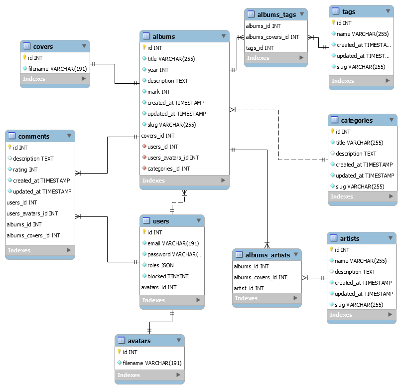

# music-reviews
## Database structure

## How to install
* enter project directory
* `docker-compose up -d` - start containers
* `docker-compose exec php bash` - enter PHP container
* `composer install` - install required dependencies
* `cd app` - enter app directory
* `bin/console doctrine:migrations:migrate` - make migrations
* `bin/console doctrine:fixtures:load` - populate database with dummy data
* `localhost:8000` - launch app in browser